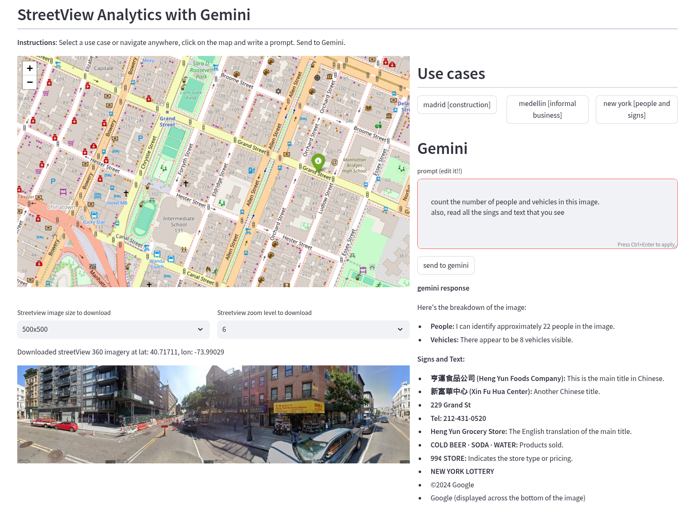

# Streetview analytics with Gemini

This demo allows you to navigate to a location in Google StreetView and use Gemini to find stuff about it. For instance

- Count people, signs, vehicles, trees
- Estimate status of road infrastructures, buildings, etc.
- Detect informal business, human activity
- Simulate modifications (night time, remove/add elements, etc)
- Read signs and panels for business, indications, places
- Anything in your imagination



# Running the demo


## Setup

create or choose a project in GCP and follow these steps


1. Enable the APIs
   
```
        export PROJECT_ID=my_project_id

        gcloud services enable --project ${PROJECT_ID} \
            maps-backend.googleapis.com \
            generativelanguage.googleapis.com \
            street-view-image-backend.googleapis.com \
            compute.googleapis.com

```

Check they are enabled

        gcloud services list --project ${PROJECT_ID} 

1. In GCP Console, under `APIS and Services` $\to$ `Credentials` create TWO new API keys. 

Allow one (`GOOGLE_MAPS_API_KEY`) to use the following API

```
        maps-backend.googleapis.com                Maps Javascript API
```

Allow the second one (`GENAI_API_KEY`) to use these APIs

```
        generativelanguage.googleapis.com          Generative Language API
        street-view-image-backend.googleapis.com   Streetview Static API
```


## Run with docker on GCP (recommended)

following instructions from https://cloud.google.com/build/docs/build-push-docker-image:

set projet id
```
export PROJECT_ID=my_project_id
gcloud config set project ${PROJECT_ID}

```
give permissions to service account
```
gcloud projects add-iam-policy-binding ${PROJECT_ID} \
    --member=serviceAccount:$(gcloud projects describe ${PROJECT_ID} \
    --format="value(projectNumber)")-compute@developer.gserviceaccount.com \
    --role="roles/storage.objectUser"

gcloud projects add-iam-policy-binding ${PROJECT_ID} \
    --member=serviceAccount:$(gcloud projects describe ${PROJECT_ID} \
    --format="value(projectNumber)")-compute@developer.gserviceaccount.com \
    --role="roles/artifactregistry.writer"

gcloud iam service-accounts add-iam-policy-binding $(gcloud projects describe ${PROJECT_ID} \
    --format="value(projectNumber)")-compute@developer.gserviceaccount.com \
    --member=serviceAccount:$(gcloud projects describe ${PROJECT_ID} \
    --format="value(projectNumber)")-compute@developer.gserviceaccount.com \
    --role="roles/iam.serviceAccountUser" \
    --project=${PROJECT_ID}

```
enable apis
```
gcloud services enable --project ${PROJECT_ID} \
    cloudbuild.googleapis.com \
    artifactregistry.googleapis.com \
    run.googleapis.com 
```
create docker image in Google Cloud

```
# create docker repo
gcloud artifacts repositories create demo-repo --repository-format=docker     --location=us-west2 --description="Docker repository"

# build image
gcloud builds submit --region=us-west2 --tag us-west2-docker.pkg.dev/${PROJECT_ID}/demo-repo/genai-streetview-demo-image:v1

# check build was ok
gcloud builds list --region=us-west2 --filter="status=SUCCESS"

```
deploy in cloud run
```

gcloud run deploy cloudrunservice --image us-west2-docker.pkg.dev/${PROJECT_ID}/demo-repo/genai-streetview-demo-image:v1 --region us-west2 --platform managed --allow-unauthenticated --port=5000 --set-env-vars=GENAI_API_KEY=<YOUR_GENAI_API_KEY>,GOOGLE_MAPS_API_KEY=<YOUR_GOOGLE_MAPS_API_KEY>

```
enable access
```

# in IAM -> Organizational policies
search for ` iam.allowedPolicyMemberDomains`, enable it and make a rule to 'allow all'

# allow for any user
gcloud beta run services add-iam-policy-binding --region=us-west2 --member=allUsers --role=roles/run.invoker cloudrunservice

# get a description of the cloudrun service
gcloud run services describe cloudrunservice --region us-west2

# copy the URL and open it in a browser

```

## Run with docker locally

install

    git clone https://github.com/rramosp/streetview_gemini_demo.git
    cd streetview_gemini_demo
    sh bin/build_docker.sh

run

    export GOOGLE_MAPS_API_KEY=[your google maps api key]
    export GENAI_API_KEY=[your genai api key]
    sh bin/run_docker.sh

open your browser at [http://localhost:5000](http://localhost:5000)


## Or run with conda envs

install

    git clone https://github.com/rramosp/streetview_gemini_demo.git
    cd streetview_gemini_demo
    conda create -n demo python=3.12
    conda activate demo
    pip install -r requirements.txt

run

    export GOOGLE_MAPS_API_KEY=[your google maps api key]
    export GENAI_API_KEY=[your geani api key]
    bin/start.sh

open your browser at [http://localhost:5000](http://localhost:5000)
