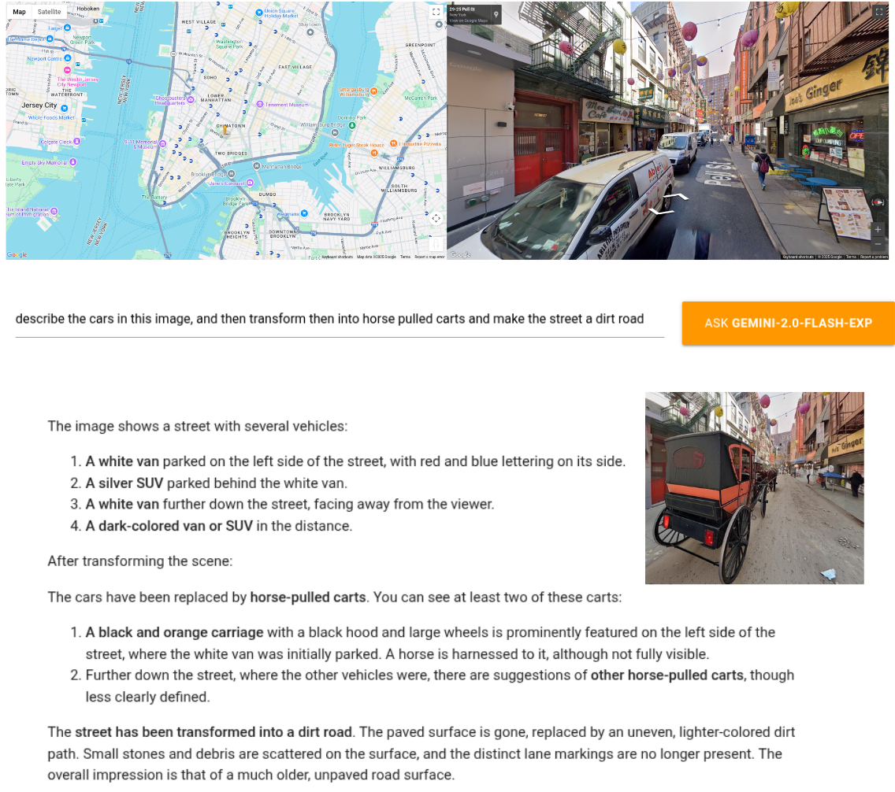

# Streetview analytics with Gemini

This demo allows you to navigate to a location in Google StreetView and use Gemini to find stuff about it. For instance

- Count people, signs, vehicles, trees
- Estimate quality/status of road infrastructures, signs, markings
- Estimate vegetation, characterize buildings
- Detect informal business, human activity
- Read signs and panels for business, indications, places
- Anything in your imagination

# Running the demo

Run this demo locally in your machine, as it uses the clipboard to communicate between Streamlit and javascript.

## with docker

install

    git clone https://github.com/rramosp/streetview_gemini_demo.git
    cd streetview_gemini_demo
    sh build.sh

run

    export STREETVIEW_API_KEY=[your streetview api key]
    export GEMINI_API_KEY=[your gemini api key]
    sh run.sh

open your browser at [http://localhost:8501](http://localhost:8501)

## with conda envs

install

    git clone https://github.com/rramosp/streetview_gemini_demo.git
    cd streetview_gemini_demo
    conda create -n demo python=3.12
    conda activate demo
    pip install -r requirements

run

    cd src
    export STREETVIEW_API_KEY=[your streetview api key]
    export GEMINI_API_KEY=[your gemini api key]
    streamlit run demo.py

open your browser at [http://localhost:8501](http://localhost:8501)
